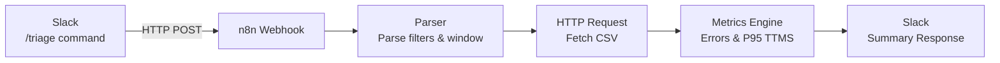

# CDN Incident Triage Bot  
**V1 (n8n + Slack) → V2 (Standalone UI + API)**
**Author & Maintainer:** Krishna Reddy  

An automated CDN incident triage system that analyzes delivery telemetry
(edge, mid-tier, cache, URL patterns, and client signals) and produces
**evidence-backed diagnosis and drill-down insights**.

This project mirrors real-world CDN/video operations and demonstrates
how operational analytics, automation, and tooling evolution can be
applied safely in production-style workflows.

---

## Data Safety

All telemetry used in this project is **synthetically generated** to mirror
real-world CDN traffic patterns.

- No production logs
- No customer data
- No proprietary systems

---

## Why This Project Exists

CDN incident triage is often:

- manual and time-consuming  
- dependent on tribal knowledge  
- difficult to standardize across teams  

Engineers must correlate:
- edge vs upstream errors  
- cache behavior  
- latency spikes  
- URL types (manifest vs segment)  
- regional POP failures  
- client / User-Agent patterns  

**This project automates first-level triage** using deterministic rules,
clear metrics, and explainable summaries.

---

# V1 — n8n + Slack (Prototype Phase)

V1 focused on **speed of iteration and signal validation**.

### Why a UI Was Required (Beyond Automation)

While n8n worked well for automated, one-shot triage, it is not designed
for interactive or conversational workflows.

Chat-based triage requires:
- deterministic and reproducible metrics
- explicit request/response boundaries
- inspectable intermediate state
- clear separation between computation and explanation

The move to a UI + API architecture in V2 was a prerequisite for any
future chat or agent-based interface. The UI externalizes system state
and makes reasoning observable, allowing conversational layers to sit
on top without compromising correctness.

## V1 High-Level Architecture

### Why a UI Was Required (Beyond Automation)

While n8n worked well for automated, one-shot triage, it is not designed
for interactive or conversational workflows.

Chat-based triage requires:
- deterministic and reproducible metrics
- explicit request/response boundaries
- inspectable intermediate state
- clear separation between computation and explanation

The move to a UI + API architecture in V2 was a prerequisite for any
future chat or agent-based interface. The UI externalizes system state
and makes reasoning observable, allowing conversational layers to sit
on top without compromising correctness.

## Demo UI (Deterministic) — Triage + Chat Controller

This demo UI provides:
- CSV URL or CSV file upload
- Filter controls: service, region, pop, window (minutes)
- Run History (last 10) stored in localStorage
- Metrics summary + raw metricsJson
- **Chat panel (Phase B1)**: chat-shaped controller that runs the same deterministic triage using the current filters

### Architecture

- The application is a single Next.js web UI.
- Users can run triage either via filters or via chat.
- Chat is currently deterministic and acts as a controller.
- All requests flow through a single `/api/triage` endpoint.
- CSV logs are used for demos; ClickHouse will replace CSV in future versions without changing the UI.

### Chat behavior (Phase B1)
Chat is not an LLM yet. It is a control surface:
- User types a message
- We optionally parse simple overrides from text:
  - `service=vod` / `svc=vod`
  - `region=use1`
  - `pop=sjc`
  - `win=60` / `window=60`
- Then the UI runs `/api/triage` deterministically and prints the summary

### Example chat inputs
- `run triage`
- `service=vod region=usw2 pop=sjc win=60`
- `svc=live win=15`

### Why deterministic first?
We intentionally keep metrics computation deterministic for:
- reproducibility
- debugging
- future ClickHouse swap without changing the UI

### ClickHouse (Mock Mode)

The ClickHouse data path is wired end-to-end (UI → API → metrics → charts)
using **simulated data**.

This validates:
- schema assumptions
- API contracts
- metrics shape
- UI and chat behavior

No ClickHouse credentials are required to run or demo the system.

The mock runner will be replaced with real 
ClickHouse execution **without any UI or API changes**.

## Update (2026-02-04) — V2 Freeze: Deterministic UI + Metrics Contract

Today we **froze V2** as a fully deterministic triage system with a stable data contract.
All LLM/agent features are deferred to **V3**.

### What shipped in V2 (frozen)

#### ✅ 1) One metrics contract for CSV + ClickHouse
Both data sources now return the **same `metricsJson` shape**, so the UI never branches on datasource.

Key contract:
- `metricsJson.available` (regions/pops/statusCodes/etc)
- `metricsJson.timeseries` with stable per-bucket points + series order

#### ✅ 2) Fixed bucket sizing (parity across modes)
Timeseries bucket size is now forced to:
- **300 seconds (5 minutes)** for **CSV and ClickHouse**

This fixes:
- bucket mismatches
- time legend drift
- chart alignment errors between CSV vs ClickHouse

#### ✅ 3) Timeseries expanded for stacked breakdowns
Each timeseries point now includes stacked maps:

- `statusCountsByCode` — counts by HTTP status code per bucket  
- `hostCountsByHost` — counts by edge host per bucket  
- `crcCountsByCrc` — counts by CRC error code per bucket  

And the timeseries includes stable legend ordering:

- `statusCodeSeries`
- `hostSeries`
- `crcSeries`

#### ✅ 4) UI updated to reflect new timeseries fields
UI now renders deterministic charts driven only from `metricsJson.timeseries`:
- Stacked **status code** chart (existing)
- **Total events by host** stacked chart (added)
- **CRC error code** chart (added)
- Correct bucket time labeling (client-safe formatting)

#### ✅ 5) Chat controller hardening (no build breakers)
Chat parsing + validation is stable:
- `service` validated via `ALLOWED.service`
- `region/pop` validated dynamically via discovered options
- safety guard resets stale region/pop when options update

#### ✅ 6) Metrics engine upgrades (CSV path)
`lib/triage/metricsEngine.js` now includes:
- robust CSV normalization and aliasing
- host/url parsing → `edge_host`, `svc`, `region`, `pop`
- service bucketing (`live|vod|other`) for deterministic filtering
- per-bucket aggregation for status/host/crc stacked charts

#### ✅ 7) ClickHouse mock upgraded (production-shape output)
`lib/clickhouse/runMockClickhouseTriage.ts` now generates:
- realistic distributions
- deterministic totals and p95/p99
- full stacked maps + stable series ordering
- same timeseries bucket size as CSV

### V2 Definition (frozen)
**V2 is deterministic analytics only.**
- UI + API + Metrics Engine must remain reproducible
- No probabilistic reasoning in core outputs
- ClickHouse real integration can replace mock **without changing UI contract**

---

## V3 (next) — LLM / Intelligence Layer (not part of V2)

V3 will add an optional AI layer **on top of frozen V2 outputs**, never inside computation.

Planned V3 capabilities:
- LLM explanation of `summaryText` + evidence formatting
- RAG over runbooks / traffic router / operational docs
- “What changed?” comparisons between runs
- Hypothesis generation (root cause candidates) using deterministic metrics as grounding
- Guided drill-down prompts (next best query / filter suggestions)

**Rule:** V3 can suggest and explain, but V2 remains source of truth for numbers.

