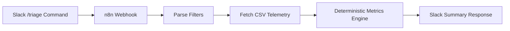
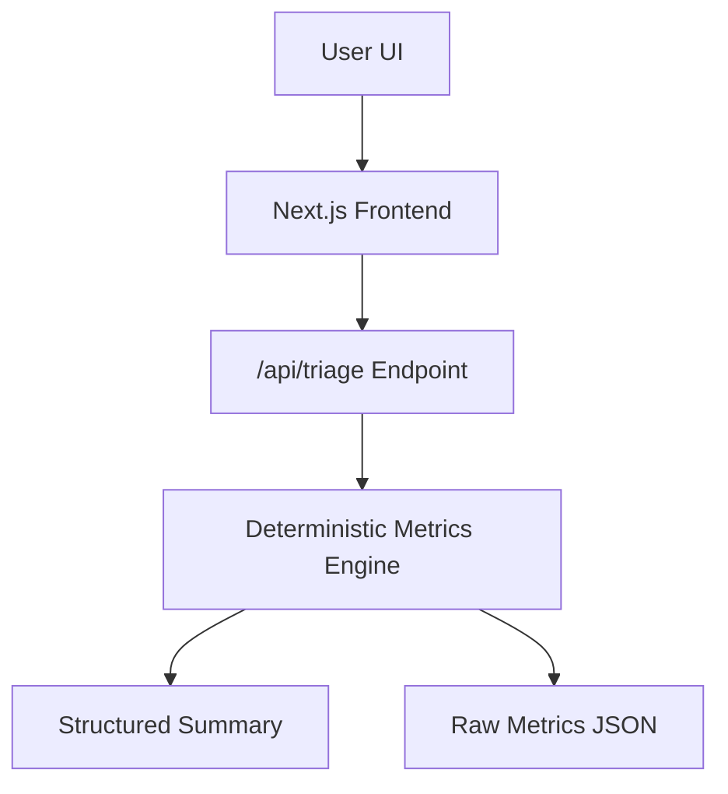
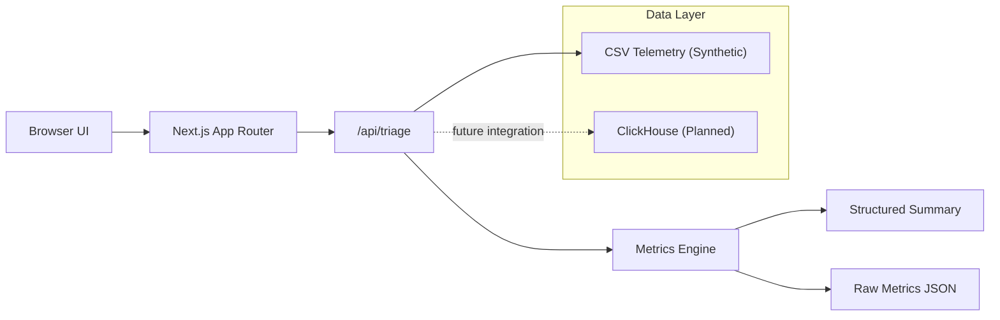

# Cachey 🤖 – CDN Incident Triage Bot

**Author:** Krishna Reddy GV  
**Production URL:** https://cdn-triage-bot.vercel.app  

---

## Overview

Cachey is an automated operational analytics system for CDN incident triage.

It analyzes structured delivery telemetry and produces deterministic,
evidence-backed summaries suitable for incident response workflows.

The system is designed around one core principle:

> Deterministic metrics computation first.  
> AI assistance second.

---

## Problem Statement

### Current Operational Challenges

- Manual and time-intensive incident triage
- Reliance on tribal knowledge
- Inconsistent reasoning across engineers
- Lack of reproducibility
- No inspectable intermediate state

### Required Correlations

Effective CDN triage requires correlating:

- Edge vs Upstream Errors  
- Cache Hit / Miss Behavior  
- P95 / P99 Latency Spikes  
- Regional POP Degradation  
- URL Type (Manifest vs Segment)  
- Client / User-Agent Patterns  

### Goal

Systematize first-level triage into deterministic, inspectable, and reproducible workflows.

---

# Architecture Evolution

---

## V1 — Automation Prototype (n8n + Slack)

### Stack

- Slack  
- n8n  
- CSV Telemetry  
- Deterministic Metrics Engine  

### Characteristics

- Slack `/triage` command  
- n8n webhook orchestration  
- One-shot triage execution  
- Summary returned directly to Slack  

### Architecture Diagram

```mermaid
flowchart LR
    A["Slack /triage Command"] --> B["n8n Webhook"]
    B --> C["Parse Filters"]
    C --> D["Fetch CSV Telemetry"]
    D --> E["Deterministic Metrics Engine"]
    E --> F["Slack Summary Response"]
```

### Limitations

- No interactive filtering  
- No persistent state  
- No conversational extensibility  
- Limited transparency into intermediate metrics  

### Conclusion

The automation prototype validated deterministic triage logic,  
but required a standalone UI + API for scalability and state management.

---

## V2 — Deterministic UI + API (Next.js)

### Stack

- Next.js (App Router)  
- React  
- TypeScript  
- Node.js  
- API Routes  

### Objectives

- Externalize system state  
- Ensure reproducibility  
- Enable inspectable intermediate state  
- Prepare for ClickHouse backend  

### Key Features

- Unified `/api/triage` endpoint  
- Explicit filter controls  
- Run history stored in LocalStorage  
- Transparent Metrics JSON  
- Deterministic execution pipeline  

### Architecture Diagram

```mermaid
flowchart TD
    A["User UI"] --> B["Next.js Frontend"]
    B --> C["/api/triage Endpoint"]
    C --> D["Deterministic Metrics Engine"]
    D --> E["Structured Summary"]
    D --> F["Raw Metrics JSON"]
```

### Design Principles

- Deterministic computation  
- Clear request/response boundaries  
- ClickHouse-ready abstraction  
- Separation of computation and explanation  
- Inspectable intermediate state  

---

## V3 — Conversational Controller

### Stack

- Deterministic Intent Parser  
- Optional OpenRouter Integration  

### Objectives

- Introduce conversational triage  
- Preserve deterministic metric computation  
- Allow filter overrides via chat  

### Behavior

- Chat input may override filters  
- Triage execution remains deterministic  
- LLM is not trusted for metric computation  

### Execution Policy

> LLM may assist in intent parsing and explanation generation only.  
> All metrics and decisions are computed deterministically.

### Example Inputs

- `run triage`  
- `svc=live region=use1 win=60`  
- `show p95 spike in bos for vod`  

---

# Current System Architecture

```mermaid
flowchart LR
    A["Browser UI"] --> B["Next.js App Router"]
    B --> C["/api/triage"]
    C --> D["Metrics Engine"]
    D --> E["Structured Summary"]
    D --> F["Raw Metrics JSON"]

    subgraph "Data Layer"
        G["CSV Telemetry (Synthetic)"]
        H["ClickHouse (Planned)"]
    end

    C --> G
    C -. "future integration" .-> H
```

---

# Technology Stack

## Frontend

- Framework: Next.js (App Router)  
- Language: TypeScript  
- UI Library: React  
- State Management: LocalStorage (Run History)  
- Rendering Strategy: Hydration-safe client rendering  

## Backend

- API Layer: Next.js API Routes  
- Runtime: Node.js  
- Analytics Layer: Custom Deterministic Metrics Engine  

## Data Layer

- Demo Source: Synthetic CSV Telemetry  
- Production Target: ClickHouse (Planned)  

## Conversational Layer

- Current Mode: Deterministic Parser  
- Optional Provider: OpenRouter  

### Example Models

- `google/gemma-3n-e2b-it:free`  
- `mistral-small-instruct`  

### LLM Scope

- Intent parsing  
- Explanation assistance  
- No non-deterministic metric computation  

---

# Deployment

## Hosting

- Vercel  
- Automatic builds from GitHub  
- Production + Preview environments  
- Build-time TypeScript validation  

## Previous Demo Method

- Cloudflare Tunnel  

## Migration Reason

- Stable hosting  
- Reliable demo access  
- CI/CD integration  

---

# Data Safety

- Telemetry is synthetic  
- No production logs  
- No customer data  
- No proprietary systems  

---

# Roadmap

- ClickHouse backend integration  
- Time-series anomaly detection  
- Blast radius estimation  
- Confidence scoring  
- Metrics export and observability  
- LLM-assisted explanation layer  
- Rate limiting  
- Authentication hardening  

---

# Engineering Philosophy

- Deterministic metrics before AI reasoning  
- Reproducibility over opacity  
- Separation of control and computation  
- Explainable summaries  
- Production-first deployment validation  

---

# Future Direction (ML Integration)

Planned enhancements include:

- Time-series anomaly detection  
- Rolling baseline deviation scoring  
- Blast radius quantification  
- Severity classification  
- Model lifecycle integration (future MLOps track)  
