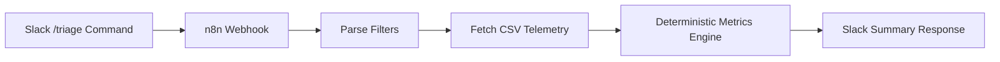
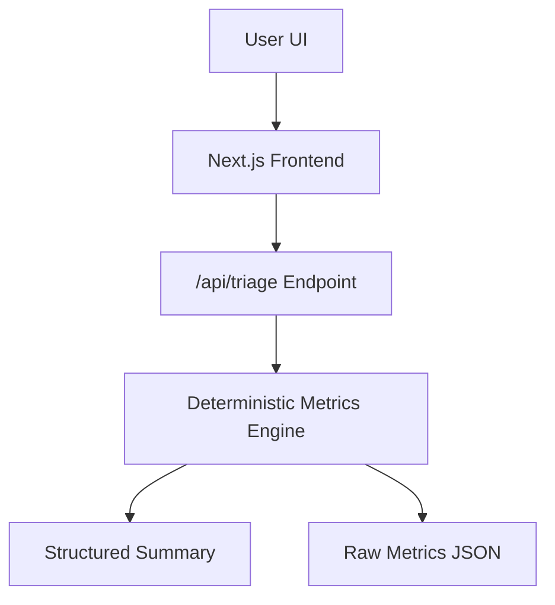
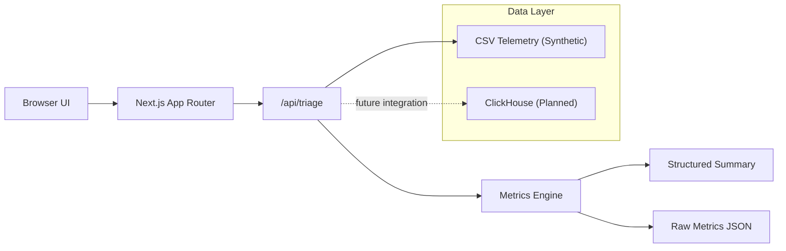
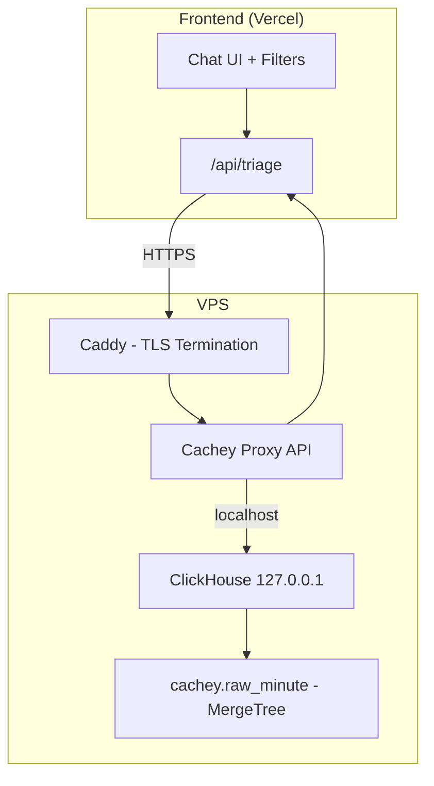

# Cachey 🤖 – CDN Incident Triage Bot

**Author:** Krishna Reddy GV  
**Production URL:** https://cdn-triage-bot.vercel.app  

---

## Overview

Cachey is a deterministic, warehouse-backed operational analytics system
designed for CDN incident triage.

It transforms structured telemetry into:

-   Deterministic metrics
-   Inspectable SQL
-   Evidence-backed summaries
-   Reproducible triage workflows

Core principle:

> Deterministic metrics first.
> AI assistance second.

All telemetry used in this repository is synthetically generated to
simulate real-world CDN delivery patterns. No production logs are used.

---

## Problem Statement

### Current Operational Challenges

- Manual and time-intensive incident triage
- Reliance on tribal knowledge
- Inconsistent reasoning across engineers
- Lack of reproducibility
- No inspectable intermediate state

### Required Correlations

Effective CDN triage requires correlating:

- Edge vs Upstream Errors  
- Cache Hit / Miss Behavior  
- P95 / P99 Latency Spikes  
- Regional POP Degradation  
- URL Type (Manifest vs Segment)  
- Client / User-Agent Patterns  

### Goal

Systematize first-level triage into deterministic, inspectable, and reproducible workflows.

---

# Architecture Evolution

---

## V1 — Automation Prototype (n8n + Slack)

### Stack

- Slack  
- n8n  
- CSV Telemetry  
- Deterministic Metrics Engine  

### Characteristics

- Slack `/triage` command  
- n8n webhook orchestration  
- One-shot triage execution  
- Summary returned directly to Slack  

### Architecture Diagram

```mermaid
flowchart LR
    A["Slack /triage Command"] --> B["n8n Webhook"]
    B --> C["Parse Filters"]
    C --> D["Fetch CSV Telemetry"]
    D --> E["Deterministic Metrics Engine"]
    E --> F["Slack Summary Response"]
```

### Limitations

- No interactive filtering  
- No persistent state  
- No conversational extensibility  
- Limited transparency into intermediate metrics  

### Conclusion

The automation prototype validated deterministic triage logic,  
but required a standalone UI + API for scalability and state management.

---

## V2 — Deterministic UI + API (Next.js)

### Stack

- Next.js (App Router)  
- React  
- TypeScript  
- Node.js  
- API Routes  

### Objectives

- Externalize system state  
- Ensure reproducibility  
- Enable inspectable intermediate state  
- Prepare for ClickHouse backend  

### Key Features

- Unified `/api/triage` endpoint  
- Explicit filter controls  
- Run history stored in LocalStorage  
- Transparent Metrics JSON  
- Deterministic execution pipeline  

### Architecture Diagram

```mermaid
flowchart TD
    A["User UI"] --> B["Next.js Frontend"]
    B --> C["/api/triage Endpoint"]
    C --> D["Deterministic Metrics Engine"]
    D --> E["Structured Summary"]
    D --> F["Raw Metrics JSON"]
```

### Design Principles

- Deterministic computation  
- Clear request/response boundaries  
- ClickHouse-ready abstraction  
- Separation of computation and explanation  
- Inspectable intermediate state  

---

## V3 — Conversational Controller

### Stack

- Deterministic Intent Parser  
- Optional OpenRouter Integration  

### Objectives

- Introduce conversational triage  
- Preserve deterministic metric computation  
- Allow filter overrides via chat  

### Behavior

- Chat input may override filters  
- Triage execution remains deterministic  
- LLM is not trusted for metric computation  

### Execution Policy

> LLM may assist in intent parsing and explanation generation only.  
> All metrics and decisions are computed deterministically.

### Example Inputs

- `run triage`  
- `svc=live region=use1 win=60`  
- `show p95 spike in bos for vod`  

---

# Current System Architecture

```mermaid
flowchart LR
    A["Browser UI"] --> B["Next.js App Router"]
    B --> C["/api/triage"]
    C --> D["Metrics Engine"]
    D --> E["Structured Summary"]
    D --> F["Raw Metrics JSON"]

    subgraph "Data Layer"
        G["CSV Telemetry (Synthetic)"]
        H["ClickHouse (Planned)"]
    end

    C --> G
    C -. "future integration" .-> H
```

---

# V4 — Warehouse-Backed Analytics (Current Phase)

## Objective

Replace CSV computation with a production-style ClickHouse warehouse
while preserving deterministic guarantees.

---

## Locked Time Semantics

For ClickHouse-backed triage:

    now := max(ts)

We DO NOT use ClickHouse `now()`.

Window calculation:

    asOf_ts = SELECT max(ts) FROM cachey.raw_minute (scoped)
    window_start = asOf_ts - INTERVAL <windowMinutes> MINUTE
    window_end   = asOf_ts

This guarantees deterministic demo-safe behavior even if ingestion lags.

---

## Infrastructure Architecture - V 4.1

```mermaid
flowchart TD

    subgraph "Frontend (Vercel)"
        UI["Chat UI + Filters"]
        API["/api/triage"]
    end

    subgraph "VPS"
        Caddy["Caddy - TLS Termination"]
        Proxy["Cachey Proxy API"]
        CH["ClickHouse 127.0.0.1"]
        Raw["cachey.raw_minute - MergeTree"]
    end

    UI --> API
    API -->|HTTPS| Caddy
    Caddy --> Proxy
    Proxy -->|localhost| CH
    CH --> Raw
    Proxy --> API
```

### Security Boundary

Public:
- `api.yourdomain.com` (HTTPS only)

Private:
- ClickHouse bound to `127.0.0.1`
- No direct port exposure (8123 / 9000)
- All browser traffic passes through proxy

ClickHouse is never internet-facing.

---

## Data Model (Current)

Table: `cachey.raw_minute`

One row per minute × slice.

Includes:

- ts  
- partner  
- service  
- region  
- pop  
- host  
- content_type  
- ua_family  
- requests  
- bytes_sent  
- p50_ms / p95_ms / p99_ms  
- cache_hit_rate  
- http status buckets (2xx/3xx/4xx/5xx + detailed codes)  
- crc_errors  

Raw table is source of truth.

---

# Conversational Execution Model

When user types:

    live in bos last 2h

System:

1. Deterministically parses filters  
2. Computes `asOf_ts = max(ts)`  
3. Constructs SQL  
4. Queries ClickHouse  
5. Returns:
   - Summary  
   - Metrics JSON  
   - Graph data  
   - Expandable SQL  
   - Expandable evidence  

LLM:
- May refine intent  
- May assist explanation  
- Never computes metrics  

---

# Technology Stack

## Frontend

- Next.js (App Router)  
- React  
- TypeScript  

## API Layer

- Next.js API Routes  
- Node.js runtime  
- Proxy API on VPS  

## Data Layer

- Synthetic telemetry generator  
- ClickHouse (MergeTree)  
- SQL as source of truth  

## Infrastructure

- VPS-hosted ClickHouse  
- Caddy reverse proxy  
- HTTPS domain routing  
- Vercel deployment for UI  

---

# Data Safety

- All telemetry is synthetic  
- No production logs  
- No customer data  
- No proprietary systems exposed  

---

# Engineering Philosophy

- Deterministic metrics before AI reasoning  
- Reproducibility over opacity  
- Clear system boundaries  
- SQL transparency  
- Production-first architecture discipline  

---

# Roadmap

## Short-Term

- SQL inspector panel  
- Evidence sampling from raw table  
- Query transparency improvements  

## Mid-Term

- Materialized views (5m rollups)  
- Time-series anomaly detection  
- Rolling baseline scoring  
- Blast radius estimation  

## Long-Term (MLOps Track)

- Feature store integration  
- Airflow orchestration  
- Automated retraining hooks  
- Severity classification models  

---

