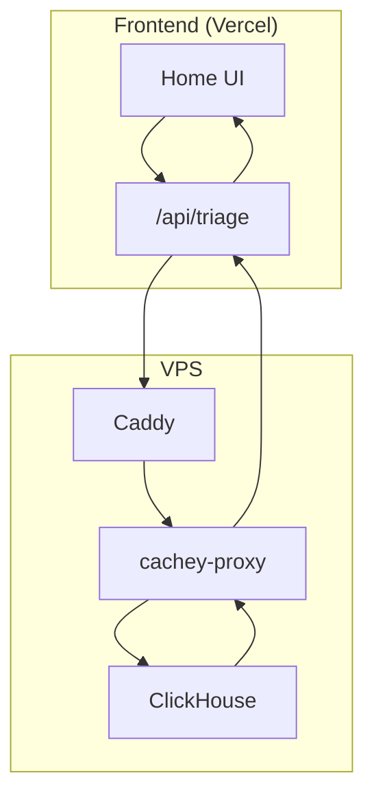

# Cachey 🤖 – Deterministic CDN Incident Triage System

**Author:** Krishna Reddy GV  
**Production URL:** https://cdn-triage-bot.vercel.app  

---

# 🚀 What is Cachey

Cachey is a deterministic, warehouse-backed CDN triage system that produces
reproducible, evidence-backed answers to operational questions.

It replaces ad-hoc, human-driven incident analysis with:

- Deterministic SQL-backed metrics  
- Structured evidence (EvidenceBundle)  
- Inspectable queries  
- Reproducible triage workflows  

> Cachey is not a dashboard and not an LLM wrapper.  
> It is an evidence-driven reasoning system.

---

# 🎯 Problem

In real CDN operations:

- Engineers manually investigate incidents  
- Explanations vary by person  
- No reproducibility  
- No shared reasoning model  
- Leadership lacks clear visibility  

Cachey systematizes this into a **deterministic, inspectable pipeline**.

---

# 🧠 Core Idea

Cachey enforces a strict flow:

User → Intent → SQL → EvidenceBundle → Reasoning → Output

No step is allowed to invent data.

---

# 🔍 Trust & Evidence Model

## 1. SQL as Source of Truth
All metrics come from deterministic SQL queries against ClickHouse.

## 2. EvidenceBundle (Structured Facts)
Includes:
- Scope (partner, service, region)
- Metrics (requests, latency, errors, cache)
- Region / POP breakdowns
- Worst offenders
- SQL queries used

## 3. Deterministic Reasoning
- Summaries
- Swarm agents
- Drill-downs

All operate ONLY on the EvidenceBundle.

---

# ⚙️ Execution Flow

1. Parse intent (chat or filters)
2. Build SQL (sqlBuilder.ts)
3. Query ClickHouse via proxy
4. Construct EvidenceBundle
5. Run deterministic reasoning (agents / summary)
6. Return:
   - Summary
   - Metrics JSON
   - Graphs
   - SQL
   - Evidence

---

# 🤖 Swarm Mode (Deterministic Agents)

Agents:
- Traffic
- Latency
- Errors
- Cache
- Scope

Each agent:
- Consumes EvidenceBundle
- Produces structured findings
- Cannot hallucinate

---

# 🔎 Drill-down System

Supports:
- worst_region
- worst_pop
- (future) time_trend

Drills:
- reuse EvidenceBundle OR
- run new deterministic SQL

---

# 🧱 System Topology

## Frontend (Vercel)
- Next.js UI
- /api/triage

## Backend (VPS - Docker)
- Caddy (TLS)
- cachey-proxy
- ClickHouse (private)

Flow:

UI → Vercel API → Caddy → Proxy → ClickHouse → Proxy → UI

---

# 🔐 Security & Deployment

- ClickHouse bound to localhost (127.x)
- No public DB access
- Proxy is only access layer
- Firewall rules enforced
- Fail2ban enabled
- TLS via Caddy
- Dockerized services on VPS

---

# 📦 Technology Stack

## Frontend
- Next.js
- React
- TypeScript

## Backend
- Node.js
- Vercel Serverless
- cachey-proxy

## Data
- ClickHouse (MergeTree)
- Synthetic telemetry generator

## Infra
- VPS (Docker)
- Caddy
- Vercel

---

# 🔗 Shared Telemetry Generator

Separate reusable system:

- Defines canonical telemetry schema
- Generates realistic CDN traffic patterns
- Used by Cachey (analytics)
- Used by future ML models

Prevents drift between analytics and ML.

---

# 🧭 Design Principles

- Deterministic first, AI second  
- SQL is truth  
- Evidence before explanation  
- Reproducibility over intuition  
- Secure-by-default architecture  

---

# 🚀 Roadmap

## Near-term
- SQL inspector
- Better evidence panels
- Drill expansions

## Mid-term
- Materialized views
- Time-series anomaly detection

## Long-term
- ML integration (shared generator)
- Feature store
- Model-assisted triage

---

# 🧱 Architecture Evolution (Historical)

## V1 – Slack + n8n
- One-shot triage
- No UI

## V2 – UI + API
- Deterministic pipeline
- Local state

## V3 – Conversational Layer
- Intent parsing
- Chat interface

## V4 – ClickHouse + Proxy (Current)

```mermaid
flowchart TD
  subgraph VERCEL["Frontend (Vercel)"]
    UI["Home UI"]
    API["/api/triage"]
  end

  subgraph VPS["VPS"]
    CADDY["Caddy"]
    PROXY["cachey-proxy"]
    CH["ClickHouse"]
  end

  UI --> API
  API --> CADDY
  CADDY --> PROXY
  PROXY --> CH
  CH --> PROXY
  PROXY --> API
  API --> UI
```
