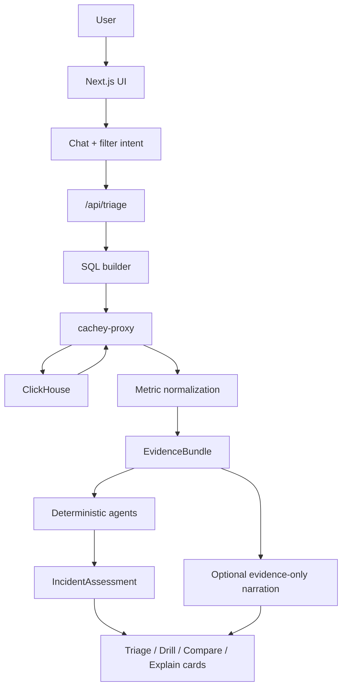
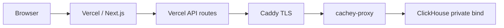

# Cachey

Deterministic CDN incident triage, backed by ClickHouse evidence.

**Production:** https://cdn-triage-bot.vercel.app
**Author:** Krishna Reddy GV

Cachey turns CDN telemetry into reproducible incident assessments. It is built around a simple rule: operational answers should come from inspectable data, not guesses.

```text
User intent -> SQL -> ClickHouse metrics -> EvidenceBundle -> deterministic agents -> incident assessment
```

Cachey is not a dashboard skin and not an LLM wrapper. The core triage path is deterministic. Optional AI is used only to narrate or explain evidence that the system has already produced.

## Why This Exists

CDN incidents are often investigated manually:

- engineers jump between dashboards, logs, and tribal knowledge
- explanations vary from person to person
- leadership gets summaries without the evidence trail
- follow-up questions restart the investigation instead of continuing it

Cachey makes the first pass of incident triage structured, repeatable, and inspectable.

## What Cachey Does

- Parses operational intent from chat or UI filters
- Builds parameterized ClickHouse SQL for the selected scope and time window
- Queries canonical CDN telemetry through a private proxy
- Normalizes metrics into an EvidenceBundle
- Runs deterministic agents for scope, traffic, latency, errors, and cache
- Produces an IncidentAssessment with severity, primary signal, blast radius, findings, graphs, and next actions
- Supports drill-downs for worst region, POP, UA family, content type, host, status code, time trend, and comparison
- Keeps SQL, evidence, metrics, and diagnostics inspectable
- Uses optional narration only after evidence exists

## Core Concepts

### EvidenceBundle

The EvidenceBundle is the source of truth for reasoning. It contains:

- normalized investigation scope
- time window metadata
- current and previous metrics
- derived deltas
- region, POP, UA, content, host, and status breakdowns
- time-series points
- SQL and diagnostics

Every agent consumes this bundle. No agent invents metrics.

### Deterministic Agents

Cachey runs five focused agents:

| Agent | Responsibility |
|---|---|
| Scope | Confirms partner, service, region, POP, content type, and UA scope |
| Traffic | Detects missing traffic, drops, low-volume windows, and traffic shifts |
| Latency | Evaluates p95/p99 latency and latency deltas |
| Errors | Evaluates 5xx volume, error rate, and error deltas |
| Cache | Evaluates cache hit rate and cache degradation |

The agents return structured findings, severity, summaries, graph hints, and recommended next steps.

### IncidentAssessment

Agent output is combined into a single assessment:

- overall state: ok, warn, or critical
- primary signal: traffic, latency, errors, cache, or mixed
- key findings
- blast radius across regions and POPs
- evidence used
- recommended next actions

## Architecture


```mermaid
flowchart TD
  User["User"] --> UI["Next.js UI"]
  UI --> Router["Chat + filter intent"]
  Router --> API["/api/triage"]
  API --> SQL["SQL builder"]
  SQL --> Proxy["cachey-proxy"]
  Proxy --> CH["ClickHouse"]
  CH --> Proxy
  Proxy --> Normalize["Metric normalization"]
  Normalize --> Evidence["EvidenceBundle"]
  Evidence --> Agents["Deterministic agents"]
  Agents --> Assessment["IncidentAssessment"]
  Assessment --> Cards["Triage / Drill / Compare / Explain cards"]
  Evidence --> Narration["Optional evidence-only narration"]
  Narration --> Cards
```

## Deployment Topology


```mermaid
flowchart LR
  Browser["Browser"] --> Vercel["Vercel / Next.js"]
  Vercel --> API["Vercel API routes"]
  API --> Caddy["Caddy TLS"]
  Caddy --> Proxy["cachey-proxy"]
  Proxy --> ClickHouse["ClickHouse private bind"]
```

ClickHouse is not exposed publicly. The proxy is the only access layer, protected by environment-level configuration and token support.

## Tech Stack

| Layer | Technology |
|---|---|
| UI | Next.js, React, TypeScript, Tailwind |
| API | Next.js route handlers, Node.js runtime |
| Data | ClickHouse MergeTree tables |
| Querying | Parameterized SQL builder |
| Reasoning | Deterministic TypeScript agents |
| Optional narration | OpenAI Responses API |
| Deployment | Vercel, VPS, Docker, Caddy |

## Repository Map

```text
ui/
  app/
    api/triage/       Core triage API
    api/chat/         Deterministic chat/router support
    api/narrate/      Optional evidence-only narration
    page.tsx          Main Cachey UI
  components/
    cards/            Triage, drill, compare, explain cards
    chat/             Chat input and conversation thread
    graphs/           Time-series and status visualizations
    mission/          Active investigation context
  lib/
    clickhouse/       SQL builder and ClickHouse triage runner
    triage/           EvidenceBundle, agents, severity, drills
    chat/             Parsing, guardrails, exploration helpers
    schema/           Canonical partners, services, regions, POPs

docs/
  Architecture, deterministic logic, telemetry, infra, and ClickHouse runbooks

scripts/
  Synthetic telemetry generation

n8n/
  Historical prototype workflow
```

Note: `notebook/worker` is an adjacent experimental worker for PDF-to-training-video generation. It is intentionally not part of the CDN triage architecture and is planned to move into its own repository.

## Local Development

```bash
cd ui
npm install
npm run dev
```

Then open:

```text
http://localhost:3000
```

Useful scripts:

```bash
npm run dev
npm run build
npm run lint
```

## Environment

The triage app can run against a proxy-backed ClickHouse deployment.

Common environment variables:

```text
CACHEY_PROXY_URL=
CACHEY_PROXY_TOKEN=
OPENAI_API_KEY=
OPENAI_NARRATION_MODEL=
```

If `OPENAI_API_KEY` is not configured, narration falls back to deterministic summaries. The core triage pipeline still works when data access is configured.

## Example Investigation

User asks:

```text
How was live traffic for partner_01 last night?
```

Cachey:

1. Normalizes the scope: `partner_01`, `live`, selected time window
2. Builds SQL for ClickHouse
3. Retrieves traffic, latency, errors, cache, and breakdown metrics
4. Constructs an EvidenceBundle
5. Runs deterministic agents
6. Returns an assessment with findings, graphs, SQL, evidence, and next actions

Follow-up:

```text
Show me the worst POP.
```

Cachey reuses the investigation scope, resolves the drill request, and returns ranked evidence plus supporting time-series context.

## Design Principles

- SQL is the source of truth
- Evidence comes before explanation
- Deterministic reasoning drives the incident assessment
- AI can narrate evidence, but cannot create facts
- Every answer should be inspectable
- Triage should continue through follow-ups instead of restarting from scratch

## Project Evolution

| Version | Direction |
|---|---|
| V1 | Slack + n8n prototype for one-shot triage |
| V2 | UI and API with deterministic local state |
| V3 | Conversational triage interface |
| V4 | ClickHouse-backed, proxy-secured, evidence-first triage engine |

## Roadmap

- SQL inspector and stronger evidence panels
- More drill-down surfaces and comparison views
- Materialized views for faster historical windows
- Time-series anomaly detection
- Shared telemetry generator for analytics and future ML workflows
- Model-assisted triage that remains evidence-bound

## The Point

Cachey is built for the first five minutes of an incident: quickly identify what changed, where it changed, why the system thinks so, and what to inspect next.
