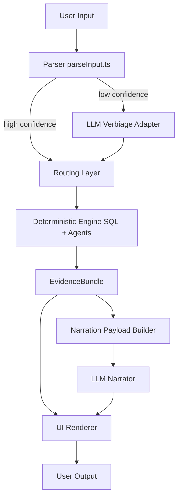

# Cachey — Bounded LLM Integration (Narrator + Verbiage Adapter)

## Overview

Cachey follows a **deterministic-first architecture**:

Parser → decides intent
Deterministic Engine → computes truth
UI → renders graphs/tables
LLM → explains and improves usability

---

## Core Principle

Deterministic System = Source of Truth
LLM = Language Layer (Translator + Narrator)

LLM is strictly bounded.

---

## What LLM CAN Do

### Narrator

* Explain results
* Summarize findings
* Suggest next actions
* Improve readability

### Verbiage Adapter

* Normalize user language
* Handle synonyms / messy phrasing
* Improve parser success rate

---

## What LLM MUST NEVER Do

* Generate SQL
* Infer schema
* Compute metrics
* Override deterministic agents
* Change scope (partner/service)
* Invent data

---

## System Architecture

### High-Level Flow

User Input
↓
Parser (parseInput.ts)
↓
IF low confidence → LLM Verbiage Adapter
↓
Lane Selection (triage / exploration / drill / compare / explain)
↓
Deterministic Engine (SQL + agents)
↓
EvidenceBundle
↓
UI renders graphs/tables
↓
NarrationPayload built
↓
LLM Narrator
↓
UI displays explanation

---

## Mermaid Diagram



---

## Visio Diagram (Copy Blocks)

[User Input]

↓

[Parser (parseInput.ts)]
├── High Confidence → [Routing]
└── Low Confidence → [LLM Verbiage Adapter] → [Routing]

↓

[Deterministic Engine (SQL + Agents)]

↓

[EvidenceBundle]

↓

[UI Renderer (Graphs / Cards)]

↓

[Narration Payload Builder]

↓

[LLM Narrator]

↓

[Final UI Output]

---

## Narration Payload

```ts
type NarrationPayload = {
  userQuestion: string;
  parsedIntent: string;

  cardType: "triage" | "exploration" | "drill" | "compare" | "explain" | "status";

  activeScope: {
    partner: string;
    service: string;
    region: string;
    pop: string;
  };

  timeWindow: {
    label: string;
    actualStart: string;
    actualEnd: string;
  };

  confidence: "high" | "medium" | "low";

  deterministicSummary: string;
  keyFindings: string[];

  agentOutputs: Record<string, string>;

  importantMetrics: Record<string, number | string>;

  evidenceUsed: string[];

  allowedNextActions: string[];
};
```

---

## Payloads by Card Type

### Triage

```ts
{
  overallState: string;
  primarySignal: string;

  metrics: {
    requests: number;
    p95: number;
    p99: number;
    errorRate: number;
    cacheHitRate: number;
  };

  atsSummary: {
    hit: number;
    miss: number;
    refresh: number;
    clientErr: number;
    infraErr: number;
  };

  keyFindings: string[];
}
```

---

### Exploration

```ts
{
  metric: string;
  view: "timeseries" | "breakdown" | "compare";

  seriesSummary: {
    latest: number;
    trend?: "up" | "down" | "stable";
  };
}
```

---

### Drill

```ts
{
  drillType: string;
  selectedEntity: string;
  rowsSummary: string[];
}
```

---

### Compare

```ts
{
  current: number;
  previous: number;
  delta: number;
  direction: "up" | "down";
}
```

---

### Explain

```ts
{
  primarySignal: string;
  agentOutputs: Record<string, string>;
  keyFindings: string[];
}
```

---

### Status

```ts
{
  statusCounts: Record<string, number>;
  dominantStatuses: string[];
}
```

---

## LLM Prompt

### System Prompt

```
You are Cachey’s narrator.

Rules:
- Use ONLY the provided evidence
- Do NOT invent metrics
- Do NOT contradict agent outputs
- Be concise and operational
- Focus on debugging relevance
```

---

### Input Template

```
User Question:
{userQuestion}

Context:
{scope + timeWindow}

Agents:
{agentOutputs}

Key Findings:
{keyFindings}

Metrics:
{importantMetrics}

Evidence:
{evidenceUsed}
```

---

### Output

```ts
type NarrationOutput = {
  explanation: string;
  evidenceUsed: string[];
  nextActions: string[];
};
```

---

## What NOT to Send to LLM

Avoid:

* Full SQL queries
* Large timeseries arrays
* Raw logs
* Full UI blobs

Send instead:

* Summaries
* Top-N rows
* Derived metrics

---

## Design Philosophy

Metrics → Agents → Truth
Truth → LLM → Explanation
Explanation → UI → User


---

## Final State

* Deterministic system remains authoritative
* LLM improves usability without risk
* No Redis dependency
* Clean separation of concerns
